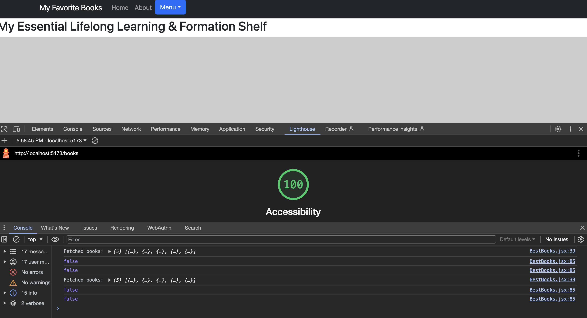
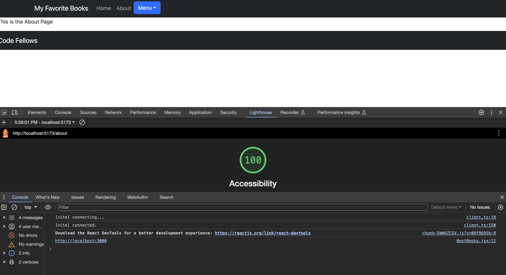
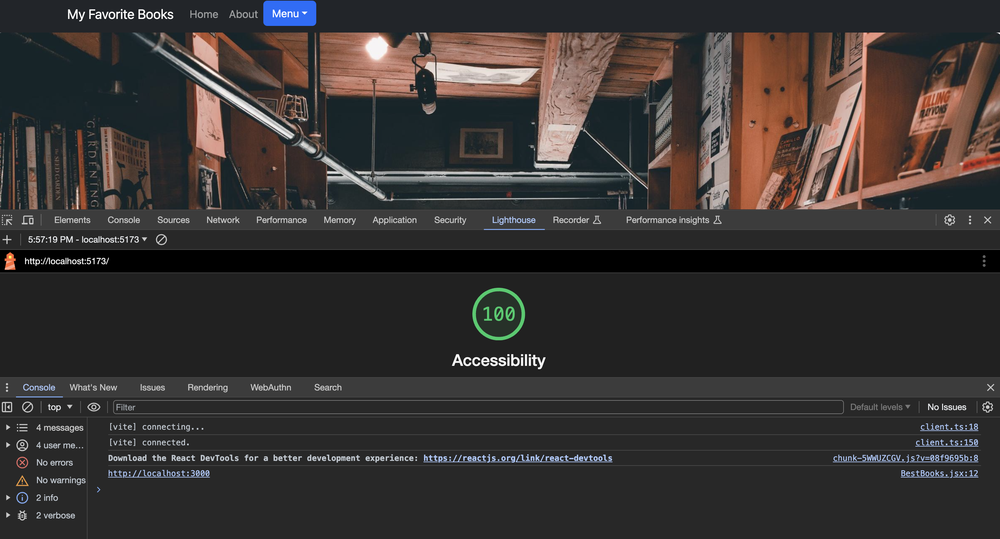

# Can of Books Lab 11-14

## Labs

**Author**: Xin Deng, Johnny Backus

### Lab 11 - Custom Servers with Node and Express

**Version**: 1.0.0 (Set up server and lightweight front end to retrieve and display books from a Mongo Database)

### Lab 12 - Resource Create and Delete

**Version**: 1.0.1 (Added Create and Post abilities)

### Lab 13 - Update a Resource

**Version**: 1.0.2 (Added Update ability and applied some styling to page)

### Lab 14 - TBD

**Version**: 1.0.3 (TBD - plan to add password authentication)

## Overview

This site is the result of a collaborative student project by CodeFellows Coding Program out of Seattle, WA.The purpose is to demonstrate the ability to work in pairs and quickly deploy a full stack app. The front-end utilized a React Framework with Bootstrap Components. The server was built with NodeJS and our database was MongoDB. Other dependencies included express, axios, cors, dotenv, and mongoose.

For this application books were used as our sample resource. REST principles allow the visitor to access and manipulate book data through four methods - Create, Read, Update, and Delete also known as CRUD. The user can add a book to the database, view all books in the database, update a book in the database, and delete a book from the database. The user can also view a list of books that they have added to the database.

## Getting Started

Starting this project first required a work agreement among the students.

## Architecture

REST Architecture implementing CRUD principles. Tools used include REACT, JavaScript, APIs, Axios, MONGODB, Express, Axios, Cors, BootStrap , and Mongoose.

## Change Log

See version log

## Credit and Collaborations

Monday:
[Johns In Class Demo Lab 11](https://github.com/codefellows/seattle-code-301d110/tree/main/class-11/demo)

ChatGPT/Tammy, John, Brandon

Tuesday:
[Johns In Class Demo Lab 12](https://github.com/codefellows/seattle-code-301d110/blob/main/class-12/demo/back-end/server.js)

ChatGPT: (https://chat.openai.com/share/5e83ccaa-f50d-4505-b49e-149e9bddfe53)
TA's: Brandon, Ike

Wednesday:
[Johns In Class Demo Lab 13](https://github.com/codefellows/seattle-code-301d110/tree/main/class-13/demo)

ChatGPT:
TA's: Brandon - much help received with verifiying connection of a new server and troubleshooting issues with displaying modals.

Friday:

## Time Estimates

### Lab 11

1. Number and name of feature: Feature #1: Set up your repositories
   - Estimate of time needed to complete: 1 hrs
   - Start time: 1:40pm
   - Finish time: 2:30pm
   - Actual time needed to complete: 1 hr

2. Number and name of feature: Feature #2: Storage: As a user, I'd like to view the list of books, so that whenever I visit the page, I can see the a full list of best books.
   - Estimate of time needed to complete: 4 hrs
   - Start time: 2:30pm
   - Finish time: NA
   - Actual time needed to complete: 8 hrs and still not done

3. Number and name of feature: Feature 3: Book Component: As a user, I'd like to see the list of books, so that I can see what's recommended to me.
   - Estimate of time needed to complete: 3 hrs
   - Start time: NA
   - Finish time: NA
   - Actual time needed to complete: NA

### Lab 12

1. Number and name of feature: Feature #1: Create: As a user, I'd like to add a new book to the shelf, so that I can update the list with my own recommendations.
   - Estimate of time needed to complete: 3 hrs
   - Start time: 2:30pm
   - Finish time: 9:00pm
   - Actual time needed to complete: 7 hr 30 min

2. Number and name of feature: Feature #2: Delete: As a user, I want to remove books from my list, so that only the most important books are on my shelf.
   - Estimate of time needed to complete: 3 hrs
   - Start time: 9:00pm
   - Finish time: NA
   - Actual time needed to complete: 9 hrs and still not done

### Lab 13

1. Number and name of feature: Feature #1: Update: As a user, I want to update book details on my list, so that I can change the book status, or update the book details as I learn more about it.
   - Estimate of time needed to complete: 3 hrs
   - Start time: 1:00pm
   - Finish time: 6:00pm
   - Actual time needed to complete: 5 hr

### Lab 14

1. Number and name of feature: Feature #1: Authentication: As a user, I'd like to sign in with OAuth, so that I can authenticate to the site without creating yet-another username/password combo to potentially get hacked or lost.
   - Estimate of time needed to complete: 3 hrs
   - Start time:
   - Finish time:
   - Actual time needed to complete:

## Lighthouse Accessibility Report Score

